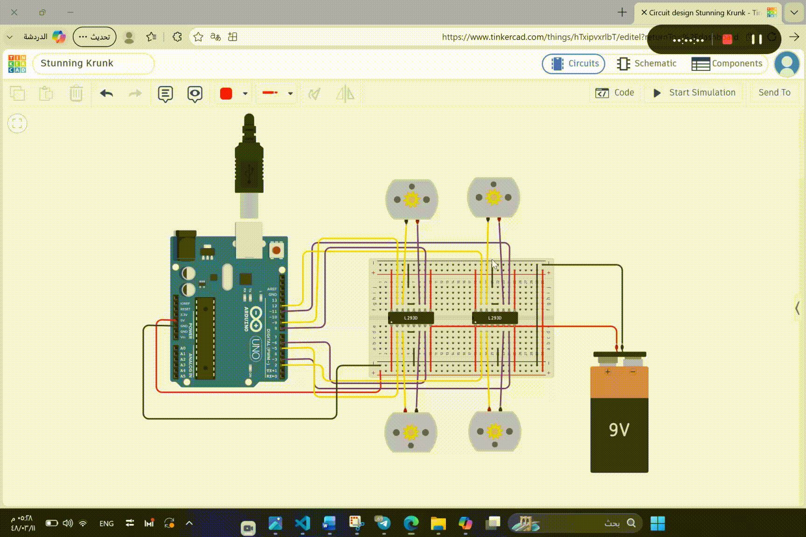

# 4-DC-Motor-Simulation

An Arduino-based simulation to control four DC motors using two **L293D Motor Driver ICs** on **Tinkercad**.

---

## 📌 Project Overview
This project implements the **first part** of the simulation task. The system controls four DC motors to perform a precise timed motion sequence as follows:

1. **Move Forward:** Drives all four motors forward for **30 seconds**.
2. **Move Backward:** Reverses all four motors to move backward for **60 seconds** (1 minute).
3. **Alternate Turning (Right & Left):** Alternates between turning right and left every second for a total duration of **60 seconds** (1 minute).
4. **Stop:** Completely stops all motors after finishing the sequence.

---

## 🎬 Simulation Demo

*(Replace `./demo.gif` with your actual GIF filename or path)*

---

## 🛠 Hardware & Components
* **Arduino Uno** (1x)
* **L293D Motor Driver IC** (2x)
* **DC Motors** (4x)
* **9V Battery** (External power supply for motors)
* **Breadboard & Jumper Wires**

---

## 🔌 Pin Connections (Mapping)

| Component | Pin Function | Arduino Pin |
| :--- | :--- | :--- |
| **DC Motor 1** | IN1 / IN2 | Pin 8 / Pin 9 |
| **DC Motor 2** | IN1 / IN2 | Pin 11 / Pin 12 |
| **DC Motor 3** | IN1 / IN2 | Pin 5 / Pin 6 |
| **DC Motor 4** | IN1 / IN2 | Pin 2 / Pin 3 |
| **L293D Drivers** | Enable Pins (1 & 9) | 5V (Breadboard Power Rail) |
| **L293D Drivers** | Logic Power VCC1 (Pin 16) | 5V (Breadboard Power Rail) |
| **L293D Drivers** | Motor Power VCC2 (Pin 8) | 9V Battery Positive Rail |
| **Ground Line** | Common GND | Arduino GND & 9V GND |

---

## 📁 Source Code
The complete C++ Arduino source code for this simulation can be found in the repository file:
👉 **[main.ino](./main.ino)** *(or replace with your actual code filename)*

---

## 🚀 How to Run the Simulation
1. Open **Tinkercad Circuits**.
2. Connect all hardware components as specified in the Pin Mapping table.
3. Upload/Paste the code from the source file into the **Code (Text)** editor.
4. Click **Start Simulation** to observe the timed motion sequence.
